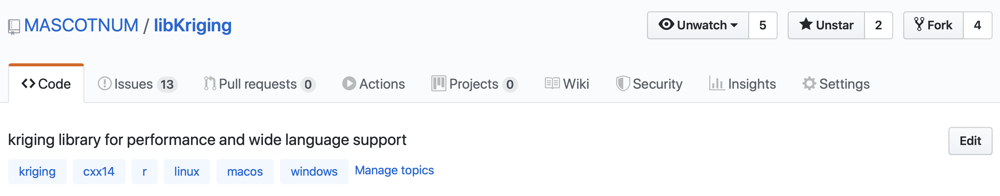
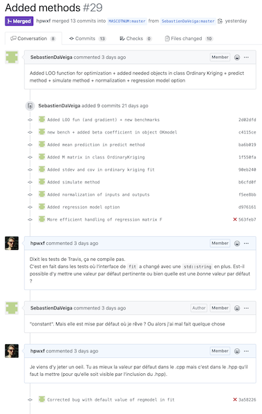

# GitHub Workflow applied to libKriging 

## 1. Create your GitHub fork of https://github.com/MASCOTNUM/libKriging
   
   To do so, use [**Fork**] (top right) button 

   

## 2. Get a local working copy

   ```
   git clone git@github.com:*your-account*/libKriging.git 
   ```

   Follow instructions in green [**Clone or download**] button

   
   
    Advice is to also have a main repository as *remote*:
   
   ```
   # add main remote repository or fetch it
   git remote add --fetch libKriging https://github.com/MASCOTNUM/libKriging.git || git fetch libKriging
   ```
   
## 3. Do your changes.

   Follow rules written in [CONTRIBUTING](CONTRIBUTING.md) section

    Do you changes into a dedicated branch
   
   ```
   # new branch starting from your local branch
   git checkout -b dev-my-new-feature
   ```
   or
   ```
   # new branch starting from main repository master
   git fetch libKriging
   git checkout -b dev-my-new-feature libKriging/master
   ```

   Once changes are done, push them:
   
   ```
   # push it
   git push -u origin dev-my-new-feature:dev-my-new-feature
   ```
   
## 4. Open a *Pull Request* using **[New pull request]** button

   * Give an explicit title to your PR

   * Add a summary to explain the proposed changes

   

## 5. Use *Pull Request* form
 
   Use *Pull Request* form to watch Travis Continuous Integration process and interact with the maintainer (code review, requested changes) 

   **Don't do any other change in the submitted branch other than those resquested to process this PR**
   
   However, you can work in any other branch.
   
   

## 6. For new developments

* start a new branch as suggested in step 3. (recommanded)
   
* once the PR is accepted, you can merge the up-to-date main repository branch with current working branch using

```
# from your local repository
git remote add --fetch libKriging https://github.com/MASCOTNUM/libKriging.git || git fetch libKriging # add main remote repository or fetch it
git merge --ff libKriging/master # update with merged master branch
git push # update your fork with it
```

  If your PR has been integrated after refactoring of the maintainer, the *merge* could not be straightforward (see [Non-perfect Pull Request procedure](CONTRIBUTING.md#non-perfect-pull-request-procedure)). 
