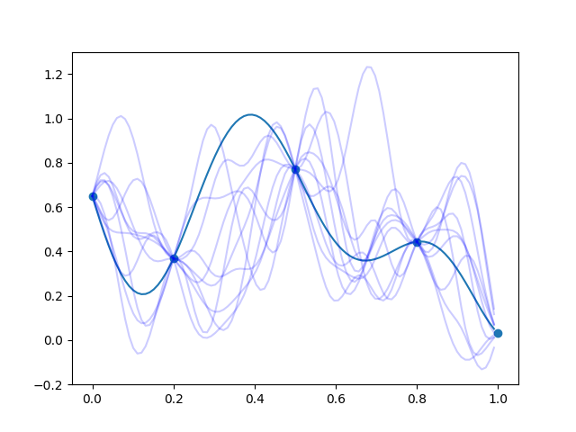

[](https://github.com/libKriging/libKriging/actions/workflows/main.yml)
[](https://github.com/libKriging/libKriging/actions/workflows/analysis.yml)
[](https://coveralls.io/github/libKriging/libKriging?branch=master)
[](https://opensource.org/licenses/Apache-2.0)

Table of contents

- [Installation from pre-built packages](#installation-from-pre-built-packages)
  - [pylibkriging for Python](#pylibkriging-for-python)
  - [rlibkriging for R](#rlibkriging-for-r)
  - [mlibkriging for Octave](#mlibkriging-for-octave)
  - [Expected demo results](#expected-demo-results)
  - [Tested installation](#tested-installation)
- [Compilation](#compilation)
  - [Requirements (more details)](#requirements-more-details)
  - [Get the code](#get-the-code)
  - [Helper scripts for CI](#helper-scripts-for-ci)
  - [Compilation and tests *manually*](#compilation-and-tests-manually)
    - [Preamble](#preamble)
    - [Compilation for Linux and macOS](#compilation-for-linux-and-macos)
    - [Compilation for Windows 64bits with Visual Studio](#compilation-for-windows-64bits-with-visual-studio)
    - [Compilation for Linux/Mac/Windows using R toolchain](#compilation-for-linuxmacwindows-using-r-toolchain)
  - [Deployment](#deployment)
    - [For Linux and macOS](#for-linux-and-macos)
    - [For Windows 64bits with Visual Studio](#for-windows-64bits-with-visual-studio)
  - [Assisted compilation and installation](#assisted-compilation-and-installation)
    - [Using `pip install` from GitHub](#using-pip-install-from-github)

If you want to contribute read [Contribution guide](CONTRIBUTING.md).

# Installation from pre-built packages

For the most common target {Python, R, Octave} x {Linux, macOS, Windows} x { x86-64 }, you can use [released binaries](https://github.com/libKriging/libKriging/releases).

## [pylibkriging](https://pypi.org/project/pylibkriging/) for Python

```shell
pip3 install pylibkriging numpy
```

**Usage example [here](bindings/Python/tests/pylibkriging_demo.py)**

<details>
<summary>👆The sample code below should give you a taste. Please refer to the reference file linked above for a CI certified example.</summary>

```python
import numpy as np
X = [0.0, 0.25, 0.5, 0.75, 1.0]
f = lambda x: (1 - 1 / 2 * (np.sin(12 * x) / (1 + x) + 2 * np.cos(7 * x) * x ** 5 + 0.7))
y = [f(xi) for xi in X]

import pylibkriging as lk
k_py = lk.Kriging(y, X, "gauss")
print(k_py.summary())
# you can also check logLikelhood using:
#def ll(t): return k_py.logLikelihood(t,False,False)[0]
#t = np.arange(0,1,1/99); pyplot.figure(1); pyplot.plot(t, [ll(ti) for ti in t]); pyplot.show()

x = np.arange(0, 1, 1 / 99)
p = k_py.predict(x, True, False)
p = {"mean": p[0], "stdev": p[1], "cov": p[2]}  # This should be done by predict

import matplotlib.pyplot as pyplot
pyplot.figure(1)
pyplot.plot(x, [f(xi) for xi in x])
pyplot.scatter(X, [f(xi) for xi in X])

pyplot.plot(x, p['mean'], color='blue')
pyplot.fill(np.concatenate((x, np.flip(x))),
            np.concatenate((p['mean'] - 2 * p['stdev'], np.flip(p['mean'] + 2 * p['stdev']))), color='blue',
            alpha=0.2)
pyplot.show()

s = k_py.simulate(10, 123, x)

pyplot.figure(2)
pyplot.plot(x, [f(xi) for xi in x])
pyplot.scatter(X, [f(xi) for xi in X])
for i in range(10):
    pyplot.plot(x, s[:, i], color='blue', alpha=0.2)
pyplot.show()
```

</details>


NB: On Windows, it should require [extra DLL](https://github.com/libKriging/libKriging/releases/download/v0.4.2/extra_dlls_for_python_on_windows.zip) not (yet) embedded in the python package.
To load them into Python's search PATH, use:
```python
import os
os.environ['PATH'] = 'c:\\Users\\User\\Path\\to\\dlls' + os.pathsep + os.environ['PATH']
import pylibkriging as lk
```

## rlibkriging for R

Download the archive from [libKriging releases](https://github.com/libKriging/libKriging/releases)
(CRAN repo will come soon...)
```shell
# example
curl -LO https://github.com/libKriging/libKriging/releases/download/v0.4.1/rlibkriging_0.4.1_macOS10.15.7-x86_64.tgz
```
Then
```R
# in R
install.packages("Rcpp")
install.packages(pkgs="rlibkriging_version_OS.tgz", repos=NULL)
```

**Usage example [here](bindings/R/rlibkriging/tests/testthat/test-rlibkriging-demo.R)**

<details>
<summary>👆The sample code below should give you a taste. Please refer to the reference file linked above for a CI certified example.</summary>

```R
X <- as.matrix(c(0.0, 0.25, 0.5, 0.75, 1.0))
f <- function(x) 1 - 1 / 2 * (sin(12 * x) / (1 + x) + 2 * cos(7 * x) * x^5 + 0.7)
y <- f(X)

library(rlibkriging)
k_R <- Kriging(y, X, "gauss")
print(k_R)
# you can also check logLikelhood using:
# ll = function(t) logLikelihood(k_R,t)$logLikelihood; plot(ll)
x <- as.matrix(seq(0, 1, , 100))
p <- predict(k_R, x, TRUE, FALSE)

plot(f)
points(X, y)
lines(x, p$mean, col = 'blue')
polygon(c(x, rev(x)), c(p$mean - 2 * p$stdev, rev(p$mean + 2 * p$stdev)), border = NA, col = rgb(0, 0, 1, 0.2))

s <- simulate(k_R,nsim = 10, seed = 123, x=x)

plot(f)
points(X,y)
matplot(x,s,col=rgb(0,0,1,0.2),type='l',lty=1,add=T)
```

</details>

## mlibkriging for Octave and matlab

⚠️ Matlab binary package is not yet available

Download and uncompress the Octave archive from [libKriging releases](https://github.com/libKriging/libKriging/releases)
```shell
# example
curl -LO https://github.com/libKriging/libKriging/releases/download/v0.4.1/mLibKriging_0.4.1_Linux-x86_64.tgz
```
Then
```shell
octave --path /path/to/mLibKriging/installation
```
or inside Octave or Matlab
```matlab
addpath("path/to/mLibKriging")
```

**Usage example [here](bindings/Octave/tests/mLibKriging_demo.m)**

<details>
<summary>👆The sample code below should give you a taste. Please refer to the reference file linked above for a CI certified example.</summary>

```matlab
X = [0.0;0.25;0.5;0.75;1.0];
f = @(x) 1-1/2.*(sin(12*x)./(1+x)+2*cos(7.*x).*x.^5+0.7)
y = f(X);
k_m = Kriging(y, X, "gauss");
disp(k_m.summary());
% you can also check logLikelhood using:
% function llt = ll (tt) global k_m; llt=k_m.logLikelihood(tt); endfunction; t=0:(1/99):1; plot(t,arrayfun(@ll,t))
x = reshape(0:(1/99):1,100,1);
[p_mean, p_stdev] = k_m.predict(x, true, false);

h = figure(1)
hold on;
plot(x,f(x));
scatter(X,f(X));
plot(x,p_mean,'b')
poly = fill([x; flip(x)], [(p_mean-2*p_stdev); flip(p_mean+2*p_stdev)],'b');
set( poly, 'facealpha', 0.2);
hold off;

s = k_m.simulate(int32(10),int32(123), x);

h = figure(2)
hold on;
plot(x,f(x));
scatter(X,f(X));
for i=1:10
   plot(x,s(:,i),'b');
end
hold off;
```

</details>

## Expected demo results

Using the previous linked examples (in Python, R, Octave or Matlab), you should obtain the following results

`predict` plot                               |  `simulate` plot
:-------------------------------------------:|:---------------------------------------------:
 | 

## Tested installation

with libKriging 0.4.8 

<!-- ✔ ⌛️ ✘ -->
|        | Linux Ubuntu:20                             | macOS 10 & 11 (x86-64)                         | macOS 12 (ARM)**                       | Windows 10                                                                  |
|:-------|:--------------------------------------------|:-----------------------------------------------|:---------------------------------------|:----------------------------------------------------------------------------|
| Python | <span style="color:green">✔</span> 3.6-3.10 | <span style="color:green">✔</span> 3.6-3.10    | <span style="color:green">✔</span> 3.9 | <span style="color:green">✔</span> 3.6-3.9                                  |
| R      | <span style="color:green">✔</span> 3.6-4.1  | <span style="color:green">✔</span> 3.6-4.1     |                                        | <span style="color:green">✔</span> 3.6-4.1                                  |
| Octave | <span style="color:green">✔</span> 5.2.0    | <span style="color:green">✔</span> 6.2         | <span style="color:green">✔</span> 6.4 | <span style="color:green">✔</span> 5.2, <span style="color:red">✘</span>6.2 |
| Matlab | <span style="color:orange">⌛️</span> R2021  | <span style="color:green">✔</span> R2021-R2022 | <span style="color:red">✘</span> R2022 | <span style="color:gray">?</span>                                           |

*requires extra DLLs. See [python installation](#pylibkriging-for-python)

**no pre-built package nor CI

# Compilation

## Requirements ([more details](docs/dev/envs/Requirements.md))

* CMake ≥ 3.13

* C++ Compiler with C++17 support
  
* Linear algebra packages providing blas and lapack functions.
  
  You can use standard blas and lapack, OpenBlas, MKL.

* Python ≥ 3.6 (optional)

* Octave ≥ 4.2 (optional)

* Matlab ≥ R2021 (optional)

* R ≥ 3.6 (optional)

## Get the code

Just clone it with its submodules:
```
git clone --recurse-submodules https://github.com/libKriging/libKriging.git
```
  
## Helper scripts for CI

Note: calling these scripts "by hand" should produce the same results as following "Compilation and unit tests" instructions (and it should be also easier).
They use the preset of options also used in CI workflow.

To configure it, you can define following environment variables ([more details](docs/dev/AllCMakeOptions.md)):

| Variable name          | Default value | Useful values                      | Comment                                         |
|:-----------------------|:--------------|:-----------------------------------|:------------------------------------------------|
|`MODE`                  | `Debug`       | `Debug`, `Release`                 |                                                 |
|`ENABLE_OCTAVE_BINDING` | `AUTO`        | `ON`, `OFF`, `AUTO` (if available) | Exclusive with Matlab binding build             |
|`ENABLE_MATLAB_BINDING` | `AUTO`        | `ON`, `OFF`, `AUTO` (if available) | Exclusive with Octave binding build             |
|`ENABLE_PYTHON_BINDING` | `AUTO`        | `ON`, `OFF`, `AUTO` (if available) |                                                 |

Then choose your `BUILD_NAME` using the following rule (stops a rule matches)

| `BUILD_NAME`     | when you want to build         | available bindings             |
|:-----------------|:-------------------------------|:-------------------------------|
| `r-windows`      | a R binding for windows        | C++, rlibkriging               | 
| `r-linux-macos`  | a R binding for Linux or macOS | C++, rlibkriging               |  
| `octave-windows` | an Octave for windows          | C++, mlibkriging               | 
| `windows`        | for windows                    | C++, mlibkriging, pylibkriging |
| `linux-macos`    | for Linux or macOS             | C++, mlibkriging, pylibkriging |

Then:
* Go into `libKriging` root directory  
    ```shell
    cd libKriging
    ```
* Prepare your environment (Once, for your first compilation)
    ```shell
    .travis-ci/${BUILD_NAME}/install.sh
    ```
* Build
  ```shell
  .travis-ci/${BUILD_NAME}/build.sh
  ```
  NB: It will create a `build` directory.

* Test
  ```shell
  .travis-ci/${BUILD_NAME}/test.sh
  ```

  
## Compilation and tests *manually*

### Preamble

We assume that:
  * [libKriging](https://github.com/libKriging/libKriging.git) code is available locally in directory *`${LIBKRIGING}`*
    (could be a relative path like `..`)
  * you have built a fresh new directory *`${BUILD}`* 
    (should be an absolute path)
  * following commands are executed in *`${BUILD}`* directory 
  
PS: *`${NAME}`* syntax represents a word or an absolute path of your choice

Select your compilation *`${MODE}`* between: 
  * `Release` : produce an optimized code
  * `Debug` (default) : produce a debug code
  * `Coverage` : for code coverage analysis (not yet tested with Windows)

Following commands are made for Unix shell. To use them with Windows use [git-bash](https://gitforwindows.org) or [Mingw](http://www.mingw.org) environments.

### Compilation for Linux and macOS

<details>
<summary>👆 expand the details</summary>
  
  * Configure
      ```shell
      cmake -DCMAKE_BUILD_TYPE=${MODE} ${LIBKRIGING}
      ```
  * Build
      ```shell
      cmake --build .
      ```
  * Run tests
      ```shell
      ctest
      ```
  * Build documentation (requires doxygen)
      ```shell
      cmake --build . --target doc
      ```
  * if you have selected `MODE=Coverage` mode, you can generate code coverage analysis over all tests using
      ```shell
      cmake --build . --target coverage --config Coverage
      ```
      or 
      ```shell
      cmake --build . --target coverage-report --config Coverage
      ```
      to produce a html report located in `${BUILD}/coverage/index.html`

</details>
   
### Compilation for Windows 64bits with Visual Studio

<details>
<summary>👆 expand the details</summary>

  * Configure
      ```shell
      cmake -DCMAKE_GENERATOR_PLATFORM=x64 -DEXTRA_SYSTEM_LIBRARY_PATH=${EXTRA_SYSTEM_LIBRARY_PATH} ${LIBKRIGING}
      ```
      where `EXTRA_SYSTEM_LIBRARY_PATH` is an extra path where libraries (e.g. OpenBLAS) can be found.
  * Build
      ```shell
      cmake --build . --target ALL_BUILD --config ${MODE}
      ```
  * Run tests
      ```shell
      export PATH=${BUILD}/src/lib/${MODE}:$PATH
      ctest -C ${MODE}
      ```
    
</details>
    
### Compilation for Linux/Mac/Windows using R toolchain

<details>
<summary>👆 expand the details</summary>

  With this method, you need [R](https://cran.r-project.org) (and [R-tools](https://cran.r-project.org/bin/windows/Rtools/) if you are on Windows).
  
  We assume you have previous requirements and also `make` command available in your `PATH`.
  
  * Configure
      ```shell
      CC=$(R CMD config CC) CXX=$(R CMD config CXX) cmake -G "Unix Makefiles" -DCMAKE_BUILD_TYPE=${MODE} ${LIBKRIGING}
      ```
  * Build
      ```shell
      cmake --build .
      ```
  * Run tests
      ```shell
      ctest
      ```
    
</details>
       
## Deployment

To deploy libKriging as an installed library, you have to add `-DCMAKE_INSTALL_PREFIX:PATH=${INSTALL_PREFIX}` option to 
first `cmake` configuration command.

If `CMAKE_INSTALL_PREFIX` variable is not set with CMake, default installation directory is `${BUILD}/installed`.

### For Linux and macOS

<details>
<summary>👆 expand the details</summary>

```shell
cmake -DCMAKE_BUILD_TYPE=${MODE} -DCMAKE_INSTALL_PREFIX:PATH=${INSTALL_PREFIX} ${LIBKRIGING}
```
and then 
```shell
cmake --build . --target install
```
aka with classical makefiles
```shell
make install
```

</details>

### For Windows 64bits with Visual Studio

<details>
<summary>👆 expand the details</summary>

```shell
cmake -DCMAKE_GENERATOR_PLATFORM=x64 -DEXTRA_SYSTEM_LIBRARY_PATH=${EXTRA_SYSTEM_LIBRARY_PATH} -DCMAKE_INSTALL_PREFIX:PATH=${INSTALL_PREFIX} ${LIBKRIGING} 
```
and then 
```shell
cmake --build . --target install --config ${MODE}
```

</details>

## Assisted compilation and installation

### Using `pip install` from GitHub

You don't need to download libKriging. `pip install` will do everything. To do that, you need the [Compilation requirements](#requirements-more-details).

```shell
python3 -m pip install "git+https://github.com/libKriging/libKriging.git"
```
will download, compile and install pylibkriging from *master* branch.

<details>
<summary>Example of build process output (~2mn)</summary>

```
Collecting git+https://github.com/libKriging/libKriging.git
  Cloning https://github.com/libKriging/libKriging.git to /private/var/folders/g0/56fnffpn6tjd5kplh140ysrh0000gn/T/pip-req-build-2xhzyw9g
  Running command git clone --filter=blob:none -q https://github.com/libKriging/libKriging.git /private/var/folders/g0/56fnffpn6tjd5kplh140ysrh0000gn/T/pip-req-build-2xhzyw9g
  Resolved https://github.com/libKriging/libKriging.git to commit 1a86dd69cf1f60b6dcd2b5e5b876cafc97d616e9
  Running command git submodule update --init --recursive -q
  Preparing metadata (setup.py) ... done
Building wheels for collected packages: pylibkriging
  Building wheel for pylibkriging (setup.py) ... done
  Created wheel for pylibkriging: filename=pylibkriging-0.4.8-cp39-cp39-macosx_12_0_x86_64.whl size=712572 sha256=7963a78f16628c5a7d877b368fdd73452e5acf01784cd6931d48dcdc08e62a5b
  Stored in directory: /private/var/folders/g0/56fnffpn6tjd5kplh140ysrh0000gn/T/pip-ephem-wheel-cache-o7kxij3t/wheels/52/71/b0/e534f2249e9180c596a5b785cf0bfa5471fcfd38d2987318f8
Successfully built pylibkriging
Installing collected packages: pylibkriging
Successfully installed pylibkriging-0.4.8
```

</details>

To get a particular version (branch or tag ≥v0.4.9), you can use:
```shell
python3 -m pip install "git+https://github.com/libKriging/libKriging.git@tag"
```

