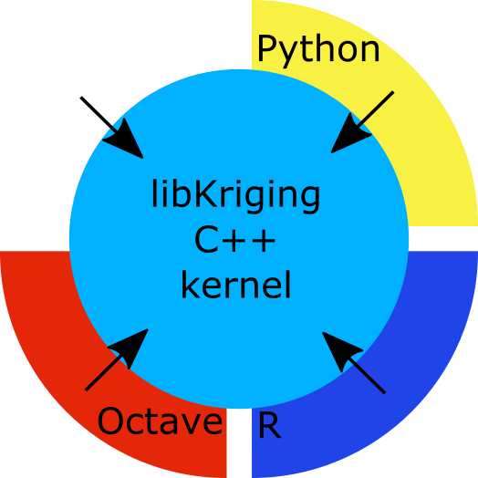

# libKriging Architecture #

The architecture of libKriging is built on a C++ kernel with efficient kriging algorithms

Around this kernel, there are multiple bindings (today, only R binding is available). 
These bindings are a thin layer around C++ kernel which call features from C++ kernel thru a light mapping
of the relevant objects.

There isn't any intensive computation in the bindings.

All the algorithms are shared in C++ kernel.  

