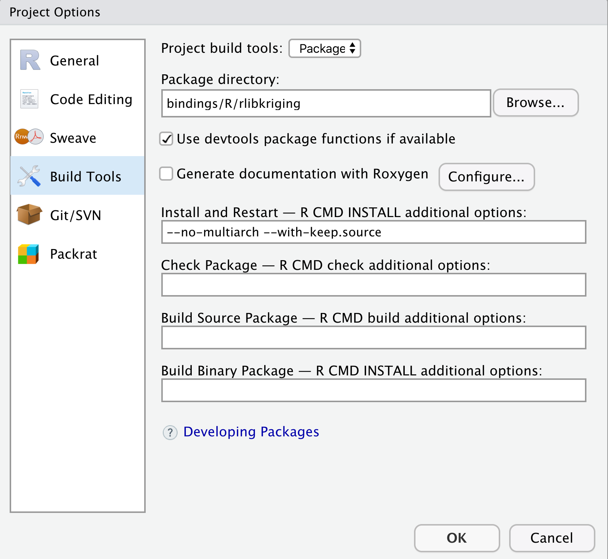

# Using C++ libKriging inside RStudio

We describe here how to embed `libKriging` C++ library in your own package built with RStudio.

## 1. Build and install `libKriging` C++ library

Follow steps writen in main [README.md](../../README.md) in sections
[Compilation for Linux/Mac/Windows using R toolchain](../../README.md#compilation-for-linuxmacwindows-using-r-toolchain) and [Deployment](../../README.md#deployment).

## 2. Starting a with RStudio

Use one of these three methods:
### 2.a New package project (out of libKriging directory)
 
* If you have already clone [libKriging](https://github.com/libKriging/libKriging), start a new package project using `File > New Project... > New Directory > R Package using Rcpp Armadillo`.

* Then replace content of `Makevars` (or `Makevars.win` depending on your target architecture) using files from those from `libKriging/bindings/R/rlibkriging/src`.

* Replace content of `Makevars` (or `Makevars.win` depending on your target architecture) using files from those from `libKriging/bindings/R/rlibkriging/src`

* Replace the last line
```
include ../../check.mk
```
by
```
.check:
```
(this will bypass specific checks from rlibkriging compilation).

### 2.b New package project using git 

* You can also start a new package project using `File > New Project... > Version control > git` and fill `Repository URL` with https://github.com/libKriging/libKriging.
* Use  `Build > Configure Build Tools...` to set up the location of rlibkriging package directory.
  
  It should be like: 

### 2.c New project using existing R binding directory

You can use this method to prepare new R bindings.

* Start a new project using `File > New Project... > Existing Directory` inside `libKriging/bindings/R/rlibkriging` directory

## 3. Build package

* Before building the package, set up current libKriging C++ library path 
```
Sys.setenv(LIBKRIGING_PATH = "/path/to/libKriging/build/installed")
```

* Run `Build > Install and Restart`

# Quick installation on RStudio server

Run these commands on the RStudio server

## Get and build `libKriging`
```
system("git clone https://github.com/libKriging/libKriging.git ~/libKriging && mkdir -p ~/libKriging/build && cd ~/libKriging/build && CC=$(R CMD config CC) CXX=$(R CMD config CXX) cmake .. && cmake --build . && cmake --build . --target install")
```

## Prepare R project
```
Sys.setenv(LIBKRIGING_PATH = "/path/to/libKriging/build/installed")
```

At this point, you can open `~/libKriging/bindings/R/rlibkriging` as a new R project. `Build > Install & Restart` should be ok in your new RStudio project.

## Update and build `libKriging`
```
system("cd ~/libKriging/build && git pull --rebase --autostash && cmake . && cmake --build . && cmake --build . --target install")
```
