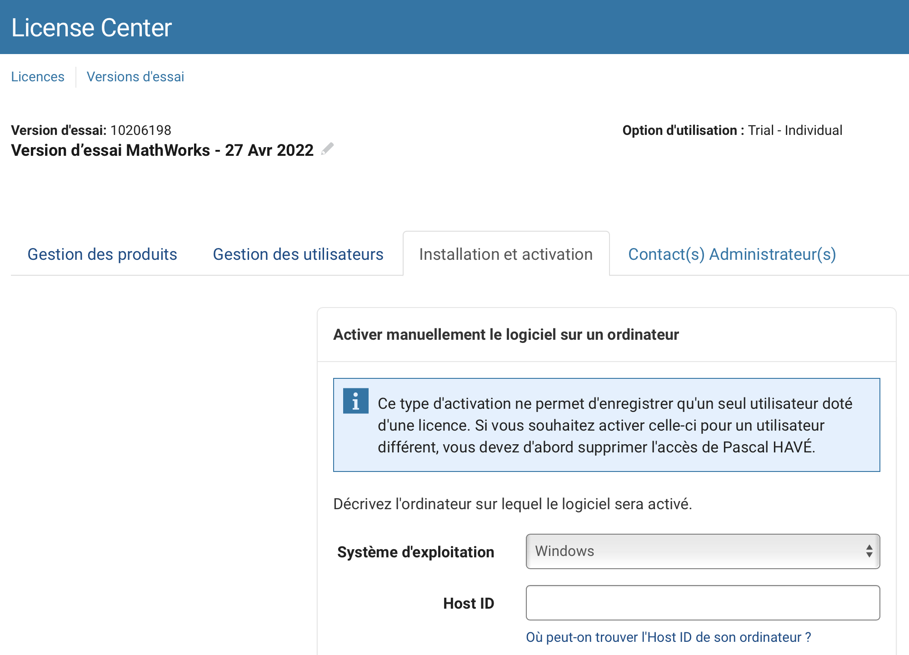

# Docker image for Ubuntu 20

The common way to build a docker image is:

```shell
docker build -t ubuntu20:dev .
```

Docker supports cross-platform image build. That's why there are arguments `TARGETPLATFORM` and `BUILDPLATFORM`. By
default, they are set to your current platform.

To cross-build a docker image, using [`docker buildx build`](https://docs.docker.com/engine/reference/commandline/buildx_build/):
```shell
# for Apple Silicon processors
docker buildx build --load --platform linux/arm64 -t ubuntu20:dev-arm64 .
# NB: without --load, the built image will stay in buildx cache and not accessible to docker run
```
or
```shell
# to build for x86-64 arch on Apple Silicon processors 
docker buildx build --load --platform linux/amd64 -t ubuntu20:dev-amd64 .
```
or
```shell
# multiple architecture build; up to now, you have to push the image on a repository to use them (cf --push) 
docker buildx build --platform linux/amd64,linux/arm64 -t ${DOCKERHUB_USER}/ubuntu20:dev . --push
docker buildx imagetools inspect ${DOCKERHUB_USER}/ubuntu20:dev # show that is a multi-arch images
# Then, you have to specify the expected arch on run
docker run --platform linux/amd64 ${DOCKERHUB_USER}/ubuntu20:dev
```

# Installing Matlab on Ubuntu

1. Run the ubuntu20 using option `-p 2022 22`
   
   It should be something like:
   ```shell
   docker run -it --rm -v ${PWD}:/data -p 2022:22 ubuntu20:dev 
   ```

2. Add required packages for Matlab
   ```shell
   apt update
   apt install -y libgtk2.0-0 libnss3 libx11-xcb1 libxcb-dri3-0 libdrm2 libgbm1 libatk-bridge2.0-0
   apt install -y intel-mkl # you should also install MKL to use Matlab with libKriging
   ```
   
3. Prepare a ssh server to be able to fill interactive registration
   ```shell
   apt install -y openssh-server unzip
   # patch the sshd config
   cat <<EOF | patch /etc/ssh/sshd_config
   --- /etc/ssh/sshd_config	2021-08-11 20:02:09.000000000 +0200
   +++ /etc/ssh/sshd_config.updated	2021-11-16 19:40:41.603431000 +0100
   @@ -88,7 +88,7 @@
    #GatewayPorts no
    X11Forwarding yes
    #X11DisplayOffset 10
   -#X11UseLocalhost yes
   +X11UseLocalhost no
    #PermitTTY yes
    PrintMotd no
    #PrintLastLog yes
   EOF
   # restart the ssh server
   /etc/init.d/ssh restart
   ```
   
4. Connect using to container
   ```shell
   ssh -p 2022 -X user@localhost
   ```
   
5. Unpack Matlab
   ```shell
   # cd /where/you/download/the/matlab/archive
   unzip -X -K matlab_R2022a_glnxa64.zip -d matlab_installer
   ```

6. Test windowing
   ```shell
    cd matlab_installer
    ./bin/glnxa64/MATLABWindow # should run without error
   ```
   
7. Install Matlab and fill registration
   ```shell
   # cd matlab_installer
   sudo mkdir /usr/local/MATLAB && sudo chown -R $USER /usr/local/MATLAB
   ./install
   ```
    
**NB**: a non-interactive installation seems to be possible, and it requires a license files; see
* https://fr.mathworks.com/help/install/ug/install-noninteractively-silent-installation.html
  
  cf `installer_input.txt` file

* https://fr.mathworks.com/licensecenter

  

# Special packages for deprecated Ubuntu 18
```shell
# commands from linux-macos/install.sh
# add kitware server signature cf https://apt.kitware.com
apt-get install -y apt-transport-https ca-certificates gnupg software-properties-common
curl -s https://apt.kitware.com/keys/kitware-archive-latest.asc | gpg --dearmor - | sudo tee /etc/apt/trusted.gpg.d/kitware.gpg >/dev/null
apt-add-repository 'deb https://apt.kitware.com/ubuntu/ bionic main'
apt-get install -y cmake # requires cmake ≥3.13 for target_link_options
````
